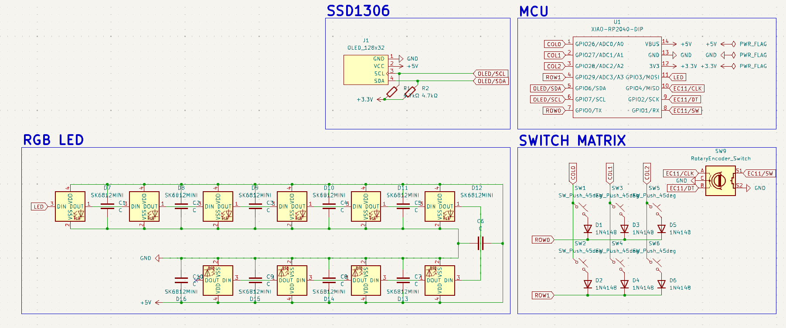
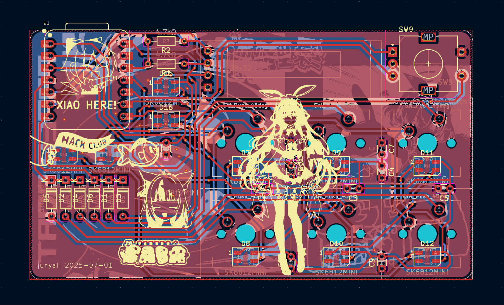
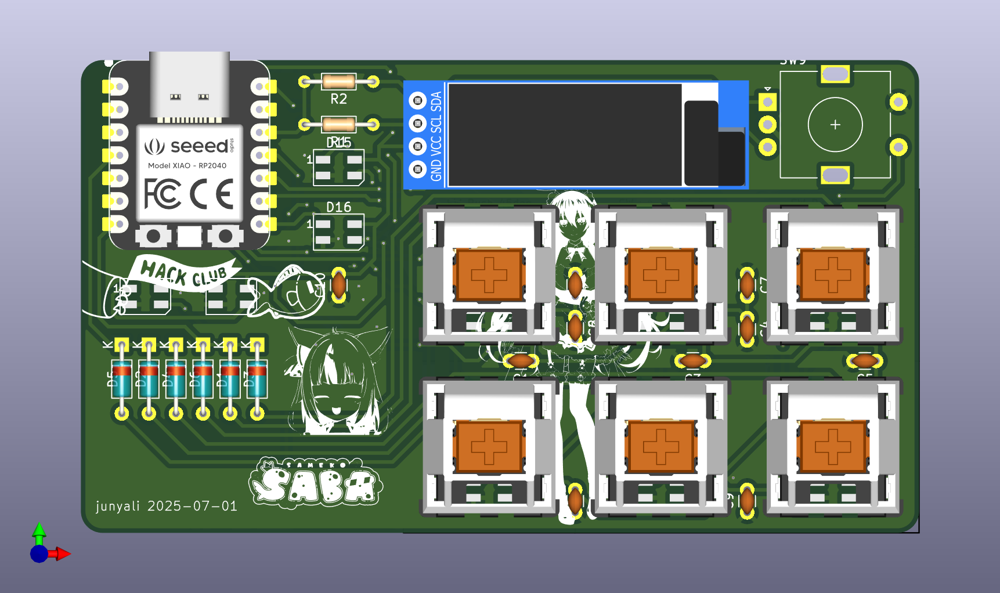
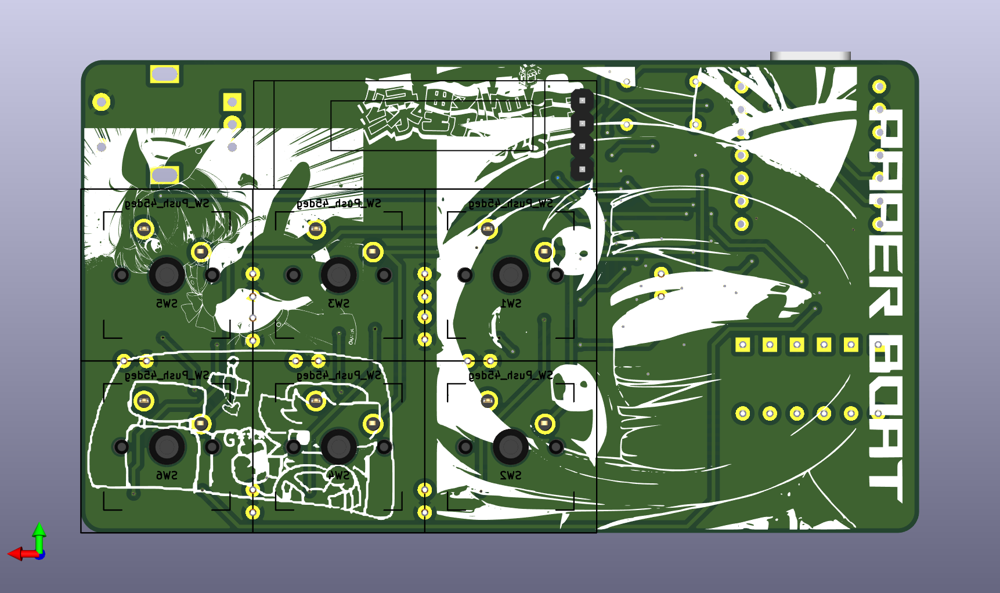
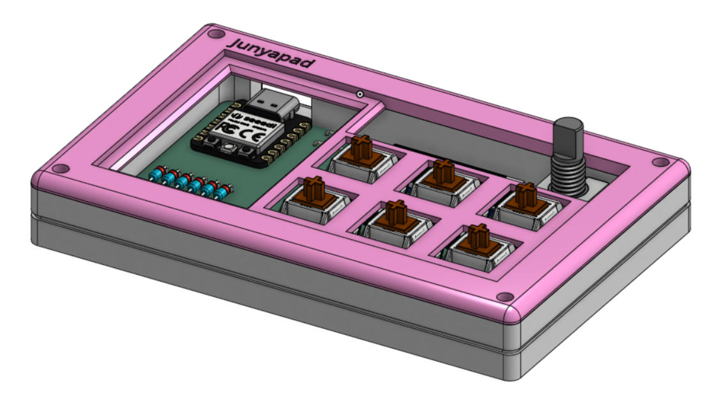

# Junyapad

A custom 6-key macropad featuring per-key RGB LEDs (with some extras :p) a 128x32 0.91" OLD screen, a rotary encoder switch and a cool semi-open case design!

PCB designed in KiCAD, case built in OnShape, and firmware built using QMK. Pretty proud of this as it's fully independent (no assistance from friends needed or Q's asked :DD)

## Preview

| Description      | Image                          |
|------------------|--------------------------------|
| Schematic        |     |
| PCB              |           |
| PCB Render Front |  |
| PCB Render Back  |   |
| Case Render      |        |

## BOM

| Component                              | Footprint                                        | Qty | Unit Price (£) | Total Price (£) | Link                                                  |
|----------------------------------------|--------------------------------------------------|-----|----------------|-----------------|-------------------------------------------------------|
| SEEED XIAO RP2040                      | XIAO-RP2040-DIP                                  | 1   | 3.99           | 3.99            | https://www.aliexpress.com/item/1005004459618789.html |
| Cherry MX switches                     | N/A                                              | 6   | 0.21           | 1.26            | https://www.aliexpress.com/item/1005006255961111.html |
| Generic Keycaps                        | N/A                                              | 6   | 0.75           | 0.75            | https://www.aliexpress.com/item/1005005386897424.html |
| 1N4148 Diodes                          | D_DO-35_SOD27_P7.62mm_Horizontal                 | 6   | 0.02           | 0.12            | https://www.aliexpress.com/item/1005006245109375.html |
| SK6812 MINI LEDs                       | LED_SK6812MINI_PLCC4_3.5x3.5mm_P1.75mm           | 10  | 0.08           | 0.80            | https://www.aliexpress.com/item/1005001971988539.html |
| 128x32 0.91" OLED Display              | OLED_128x32                                      | 1   | 0.74           | 0.74            | https://www.aliexpress.com/item/1005008640132638.html |
| EC11 Rotary Encoder Switch             | RotaryEncoder_Alps_EC11E-Switch_Vertical_H20mm   | 1   | 0.74           | 0.74            | https://www.aliexpress.com/item/1005004907970664.html |
| 4.7kΩ Resistors                        | R_Axial_DIN0204_L3.6mm_D1.6mm_P7.62mm_Horizontal | 2   | 0.05           | 0.10            | https://www.aliexpress.com/item/1005006427040577.html |
| 0.1uF Disc Capacitors                  | C_Disc_D3.0mm_W1.6mm_P2.50mm                     | 10  | 0.01           | 0.10            | https://www.aliexpress.com/item/32973259342.html      |
| M3x16mm screws                         | N/A                                              | 4   | 0.04           | 0.16            | https://www.aliexpress.com/item/32844540184.html      |
| M3 hex nuts                            | N/A                                              | 4   | 0.03           | 0.12            | https://www.aliexpress.com/item/1005007593861199.html |
| PCB Fabricated (JLCPCB, incl shipping) | N/A                                              | 5   | 0.94           | 4.70            | https://jlcpcb.com                                    |
| 3D Printed Case (#printing-legion)     | N/A                                              | 1   | 0.00           | 0.00            | https://printlegion.hackclub.com                      |

Total Price: **£13.58** (*approx US$18.54*)

*Prices are a bit wonky since most products must be bought in bulk - this is an optimistic BOM*
